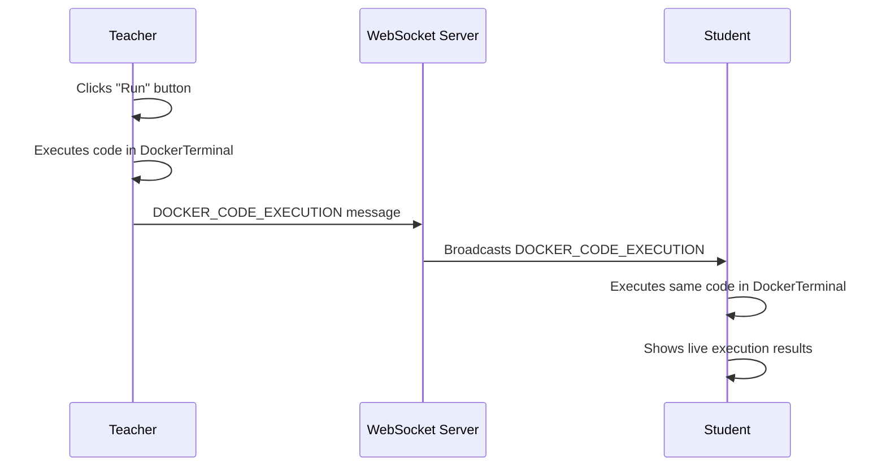

# LiveTutorialPage Docker Terminal Integration

## 🎯 Overview

Successfully integrated DockerTerminal component with LiveTutorialPage to enable real-time code execution and broadcasting for live teaching sessions. Teachers can now execute code in a secure Docker environment and automatically broadcast both the code and results to all connected students in real-time.

## 🚀 Key Features Implemented

### 1. **Real-Time Code Execution Broadcasting**
- **Teacher Experience**: When a teacher clicks "Run" in the code editor, code executes in a Docker container
- **Student Experience**: Students automatically see the same code execute in their terminals simultaneously
- **Live Demo**: Perfect for live coding demonstrations and tutorials

### 2. **Docker-Based Terminal Integration**
- **Replaced**: Old xterm.js terminal with DockerTerminal component
- **Enhanced Security**: Code runs in isolated Docker containers
- **Multi-Language Support**: Python, JavaScript, Java, and more
- **Resource Control**: Memory and CPU limits prevent abuse

### 3. **WebSocket Communication Enhancement**
- **New Message Type**: `DOCKER_CODE_EXECUTION` for broadcasting code execution
- **Preserves Existing**: Agora video/audio feeds continue working normally
- **Bidirectional**: Teacher-to-student code execution broadcast

## 🔧 Implementation Details

### Frontend Changes (LiveTutorialPage.tsx)

#### **New Imports & Components**
```typescript
import DockerTerminal from '../components/DockerTerminal';
```

#### **Enhanced handleRunCode Function**
```typescript
const handleRunCode = async () => {
    if (activeFile && role === 'teacher' && viewingMode === 'teacher' && dockerTerminalRef.current) {
        try {
            // Execute in Docker terminal
            const result = await dockerTerminalRef.current.executeCode(activeFile.content, activeFile.language);
            
            // Broadcast to all students
            sendWsMessage('DOCKER_CODE_EXECUTION', { 
                language: activeFile.language, 
                code: activeFile.content, 
                result: result,
                fileName: activeFile.name,
                timestamp: Date.now()
            });
        } catch (error) {
            // Broadcast error for teaching moments
            sendWsMessage('DOCKER_CODE_EXECUTION', { 
                language: activeFile.language, 
                code: activeFile.content, 
                error: error.message,
                fileName: activeFile.name,
                timestamp: Date.now()
            });
        }
    }
};
```

#### **Student Code Execution Handler**
```typescript
case 'DOCKER_CODE_EXECUTION':
    if (role === 'student' && dockerTerminalRef.current) {
        const { code, language, result, error, fileName } = message.payload;
        
        // Replicate teacher's code execution
        if (result) {
            await dockerTerminalRef.current.executeCode(code, language);
        }
    }
    break;
```

#### **DockerTerminal Component Integration**
```tsx
<DockerTerminal
    ref={dockerTerminalRef}
    title="Live Coding Terminal"
    showHeader={true}
    showCodeButtons={role === 'teacher' && viewingMode === 'teacher'}
    height="100%"
    initialCode={activeFile?.content || ''}
    initialLanguage={activeFile?.language || 'javascript'}
    autoConnect={true}
    enableWebSocket={true}
    className="h-full"
    onCodeExecution={(result) => {
        console.log('Docker terminal code execution result:', result);
    }}
    onError={(error) => {
        console.error('Docker terminal error:', error);
    }}
/>
```

### Backend Changes (websocketHandler.js)

#### **New WebSocket Message Handler**
```javascript
case 'DOCKER_CODE_EXECUTION':
    // Handle Docker-based code execution broadcast from teacher to all students
    if (clientInfo.role === 'teacher') {
        const { language, code, result, error, fileName, timestamp } = data.payload;
        
        console.log(`[WS] Broadcasting Docker code execution from teacher ${clientInfo.username}: ${language} code from ${fileName}`);
        
        // Broadcast to all students in the session
        broadcastToAll(session, { 
            type: 'DOCKER_CODE_EXECUTION', 
            payload: {
                language,
                code,
                result,
                error,
                fileName,
                timestamp,
                teacherName: clientInfo.username
            }
        });
    }
    break;
```

## 🎓 Usage Scenarios

### **Live Coding Demonstrations**
1. **Teacher**: Opens LiveTutorialPage and starts a coding session
2. **Students**: Join the same session and see the teacher's screen
3. **Teacher**: Writes code in the Monaco editor
4. **Teacher**: Clicks "Run" button
5. **Students**: Automatically see the code execute in their terminals in real-time

### **Interactive Learning**
- **Error Demonstration**: Teachers can show common errors and debugging
- **Step-by-Step Tutorials**: Execute code progressively during explanations
- **Multi-Language Teaching**: Switch between Python, JavaScript, Java in same session

### **Remote Classroom**
- **Video/Audio**: Agora integration continues working for face-to-face interaction
- **Screen Sharing**: Code editor is shared visually
- **Terminal Sync**: Code execution is synchronized across all participants
- **Real-Time**: No delay between teacher execution and student viewing

## 🔄 WebSocket Message Flow



## 🛡️ Security & Performance

### **Security Features**
- **Docker Isolation**: Each execution runs in separate containers
- **Resource Limits**: Memory (128MB) and CPU (0.5 cores) constraints
- **Network Isolation**: No external network access for executed code
- **Automatic Cleanup**: Containers are destroyed after execution
- **Teacher-Only Broadcasting**: Only teachers can broadcast code execution

### **Performance Optimizations**
- **Container Reuse**: DockerTerminal manages container lifecycle efficiently
- **Async Execution**: Non-blocking code execution
- **WebSocket Efficiency**: Minimal message overhead
- **Session Management**: Proper cleanup on disconnect

## 🔍 Monitoring & Debugging

### **Console Logging**
```javascript
// Teacher side
console.log('Code executed and broadcasted:', result);

// Student side  
console.log(`Teacher executed ${language} code from ${fileName}:`, result);

// Backend
console.log(`[WS] Broadcasting Docker code execution from teacher ${clientInfo.username}: ${language} code from ${fileName}`);
```

### **Error Handling**
- **Frontend**: Graceful error handling with user feedback
- **Backend**: Comprehensive error logging and broadcasting
- **Docker**: Container failures are contained and logged

## 🚀 Deployment Notes

### **Environment Requirements**
- **Docker Support**: Backend must have Docker daemon running
- **WebSocket**: Real-time communication for code broadcasting
- **Resource Allocation**: Sufficient memory/CPU for multiple containers

### **Configuration**
- **Backend**: Ensure Docker service is running
- **Frontend**: DockerTerminal auto-connects to backend
- **WebSocket**: Uses existing WebSocket connection (preserves Agora integration)

## 🎯 Benefits Achieved

1. **Enhanced Teaching**: Real-time code execution for live demonstrations
2. **Student Engagement**: Interactive terminal experience during lessons  
3. **Multi-Language Support**: Python, JavaScript, Java, and more
4. **Security**: Isolated execution environment
5. **Scalability**: Docker-based architecture scales with usage
6. **Integration**: Seamlessly works with existing video/audio systems

## 🔧 Future Enhancements

1. **Code Highlighting**: Highlight executed lines in Monaco editor
2. **Execution History**: Save and replay execution sequences
3. **Collaborative Editing**: Allow students to contribute code
4. **Breakpoint Support**: Interactive debugging capabilities
5. **Performance Metrics**: Show execution time and resource usage

This integration transforms LiveTutorialPage into a powerful platform for interactive coding education, combining video communication with real-time code execution and sharing.