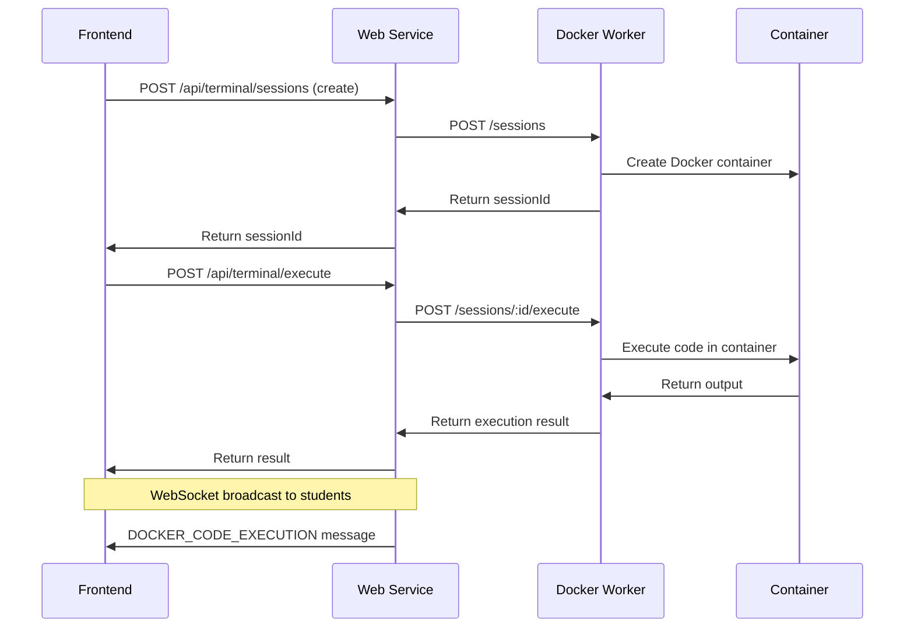

# 🏗️ Multi-Service Architecture for Docker Terminal Integration

## 🎯 **Overview**

Following Render's recommendation, we've refactored from a problematic Docker-in-Docker approach to a clean multi-service architecture. This provides better stability, security, and maintainability.

## 📋 **Architecture Comparison**

### ❌ **Before: Docker-in-Docker (Problematic)**
```
┌─────────────────────────────────────┐
│         Single Container            │
│  ┌─────────────┐ ┌─────────────┐   │
│  │ Node.js App │ │ Docker      │   │
│  │             │ │ Daemon      │   │
│  └─────────────┘ └─────────────┘   │
│         (Supervisor manages both)    │
└─────────────────────────────────────┘
```
**Issues:**
- Complex supervisor configuration
- Resource conflicts between services
- Difficult debugging and monitoring
- Docker-in-Docker permission issues

### ✅ **After: Multi-Service Architecture**
```
┌──────────────────┐    ┌──────────────────┐
│   Web Service    │    │  Worker Service  │
│                  │    │                  │
│  ┌─────────────┐ │    │ ┌─────────────┐  │
│  │ Node.js App │ │◄──►│ │Docker Worker│  │
│  │ WebSocket   │ │    │ │+ Containers │  │
│  │ API & DB    │ │    │ │             │  │
│  └─────────────┘ │    │ └─────────────┘  │
└──────────────────┘    └──────────────────┘
     Render Starter          Render Standard
       (~$7/month)           (~$25/month)
```

## 🛠️ **Services Architecture**

### **1. Web Service (`educator-app-backend`)**
- **Purpose**: Main application with WebSocket, API endpoints, database
- **Plan**: Render Starter ($7/month) - sufficient without Docker
- **Components**:
  - Express.js server with all existing routes
  - WebSocket handler for video/audio (Agora) + code execution
  - Database connections and user management
  - Docker Worker Client for communication

### **2. Worker Service (`educator-docker-worker`)**  
- **Purpose**: Isolated Docker container execution
- **Plan**: Render Standard ($25/month) - required for Docker access
- **Components**:
  - Docker container management
  - Code execution in sandboxed environments
  - WebSocket for real-time terminal communication
  - RESTful API for session management

## 📁 **New Files Created**

### **1. `dockerWorker.js`**
```javascript
// Standalone Docker worker service
const app = express();
const PORT = process.env.PORT || 10001;

// Docker session management
class DockerSession {
    async executeCode(code, language) { /* ... */ }
    async terminate() { /* ... */ }
}

// API endpoints
app.post('/sessions', createSession);
app.post('/sessions/:id/execute', executeCode);  
app.delete('/sessions/:id', terminateSession);
```

### **2. `services/dockerWorkerClient.js`**
```javascript
// Client for communicating with worker service
class DockerWorkerClient {
    constructor() {
        this.workerUrl = process.env.DOCKER_WORKER_URL; // Auto-set by Render
    }
    
    async createSession() { /* HTTP call to worker */ }
    async executeCode(sessionId, code, language) { /* HTTP call to worker */ }
    async terminateSession(sessionId) { /* HTTP call to worker */ }
}
```

### **3. `Dockerfile.worker`**
```dockerfile
FROM docker:24-dind
RUN apk add --no-cache nodejs npm curl
WORKDIR /usr/src/app
COPY package*.json ./
RUN npm ci --only=production
COPY dockerWorker.js .
CMD ["node", "dockerWorker.js"]
```

### **4. Updated `render.yaml`**
```yaml
services:
  # Main web service - Node.js application  
  - type: web
    name: educator-app-backend
    env: node  # Simple Node.js environment
    plan: starter  # Cost savings!
    
  # Docker worker service
  - type: web  
    name: educator-docker-worker
    env: docker  # Docker environment with daemon
    plan: standard  # Required for Docker access
    dockerfilePath: ./Dockerfile.worker
```

## 🔄 **Communication Flow**

### **Code Execution Request Flow**


## 🎯 **Benefits of Multi-Service Architecture**

### **1. Stability & Reliability**
- ✅ Each service runs in its dedicated, optimized container
- ✅ No complex supervisor process management
- ✅ Service isolation prevents cascading failures
- ✅ Render manages service lifecycle automatically

### **2. Cost Optimization**
- ✅ Main service uses cheaper Starter plan ($7/month)
- ✅ Only Docker worker needs Standard plan ($25/month)  
- ✅ Total: $32/month vs $25/month for single Standard service
- ✅ Better resource utilization per dollar

### **3. Development & Debugging**
- ✅ Clear separation of concerns
- ✅ Independent scaling and monitoring
- ✅ Easier to debug specific service issues
- ✅ Separate logs for each service

### **4. Security & Isolation**
- ✅ Docker operations isolated from main application
- ✅ Database and user data separate from code execution
- ✅ Worker service has minimal attack surface
- ✅ Container security handled by dedicated service

## 🚀 **Deployment Instructions**

### **Step 1: Push to GitHub**
```bash
git add .
git commit -m "Refactor to multi-service architecture

- Split Docker operations into dedicated worker service  
- Main service uses Node.js environment (cost savings)
- Worker service handles Docker with proper isolation
- Updated render.yaml for multi-service deployment
- Created dockerWorker.js and dockerWorkerClient.js

🤖 Generated with [Claude Code](https://claude.ai/code)

Co-Authored-By: Claude <noreply@anthropic.com>"
git push origin main
```

### **Step 2: Render Auto-Deployment**
- ✅ Render detects `render.yaml` changes
- ✅ Creates two separate services automatically:
  - `educator-app-backend` (Starter plan, Node.js)
  - `educator-docker-worker` (Standard plan, Docker)
- ✅ Sets up service-to-service communication automatically
- ✅ No manual configuration needed!

### **Step 3: Verify Deployment**
**Check Web Service Health:**
```bash
curl https://educator-app-backend.onrender.com/healthz
```

**Check Worker Service Health:**
```bash  
curl https://educator-docker-worker.onrender.com/health
```

**Check Docker Terminal Integration:**
```bash
curl https://educator-app-backend.onrender.com/api/terminal/health
```

## 📊 **Monitoring & Logs**

### **Web Service Logs** (educator-app-backend)
- User authentication and sessions
- WebSocket connections (Agora + code execution)
- Database operations  
- API request/response logs

### **Worker Service Logs** (educator-docker-worker)
- Docker container creation/destruction
- Code execution results
- Container resource usage
- Security events

## 🔧 **Environment Variables**

### **Web Service**
- `DOCKER_WORKER_URL` - Auto-set by Render (points to worker service)
- `DATABASE_URL`, `JWT_SECRET`, etc. - Existing environment variables

### **Worker Service**  
- `DOCKER_HOST=unix:///var/run/docker.sock` - Docker daemon access
- `PORT=10001` - Worker service port

## 🎉 **Expected Results**

### **Immediate Benefits**
- ✅ No more supervisor restart loops
- ✅ Stable Docker daemon operation
- ✅ Proper service isolation and monitoring
- ✅ Cost-optimized resource allocation

### **Long-term Benefits**
- ✅ Easier to scale individual services
- ✅ Independent deployment of web vs worker features
- ✅ Better error isolation and debugging
- ✅ Platform-aligned architecture (follows Render best practices)

## 🚀 **Next Steps**

1. **Deploy and monitor** both services
2. **Test Docker terminal functionality** in LiveTutorialPage
3. **Monitor performance** and resource usage
4. **Scale individual services** as needed

This architecture aligns perfectly with Render's design principles and provides a much more stable foundation for your Docker terminal integration! 🎯