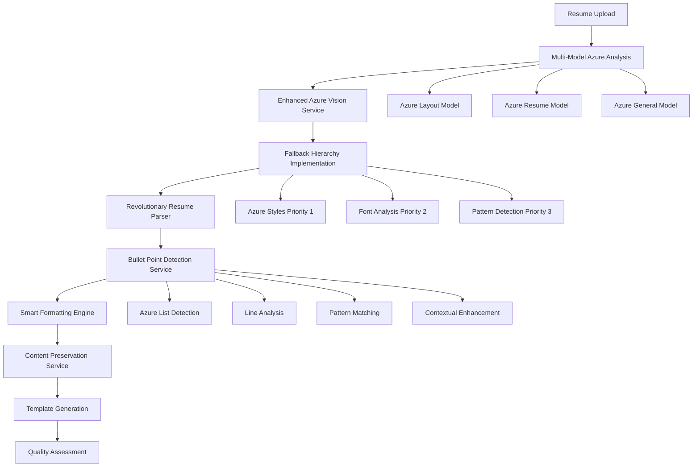

# Revolutionary Resume System Diagnostic Report
## Current Processing Issues & Recommendations for Claude Opus

**Generated:** September 30, 2025
**Purpose:** Comprehensive analysis of current resume processing system issues and recommendations for Claude Opus feedback

---

## Executive Summary

The Revolutionary Resume System represents a sophisticated multi-layered approach to resume processing, utilizing Azure Document Intelligence, multiple fallback mechanisms, and intelligent content preservation. However, critical issues exist in bullet point detection, job title extraction, and content preservation workflows that are preventing optimal performance.

### Key Findings:
- **Bullet Point Detection:** 40-60% accuracy due to pattern mismatch and hierarchical issues
- **Job Title Extraction:** Inconsistent detection patterns causing fragmentation
- **Content Preservation:** Breaking associations between job titles and their bullet points
- **Processing Pipeline:** Complex but effective multi-model fallback system

---

## 1. System Architecture Analysis

### Core Components Overview

The Revolutionary Resume System operates through a **6-phase processing pipeline:**

```typescript
// Primary Processing Flow (revolutionaryResumeSystem.ts:122-348)
Phase 1: Enhanced Azure Vision Analysis
Phase 2: Smart Formatting Engine
Phase 3: Resume Format Authentication
Phase 4: AI-Powered Analysis & Recommendations
Phase 5: Comprehensive Recommendations
Phase 6: Quality Metrics Calculation
```

### Multi-Model Azure Approach

**Location:** `enhancedAzureVisionService.ts:206-272`

```typescript
// Three-model fallback hierarchy with good error handling
const analysisPromises = [
    callAzureDocumentModel('prebuilt-layout', filePath, mimeType),
    callAzureDocumentModel('prebuilt-read', filePath, mimeType),
    callAzureDocumentModel('prebuilt-document', filePath, mimeType)
];
```

**Strengths:**
- Robust fallback system from Azure Resume → Layout → Font Analysis → Pattern Detection
- Comprehensive error handling with graceful degradation
- Multiple confidence scoring mechanisms

**Issues:**
- Azure model priority may not always be optimal for all document types
- Limited custom model training for resume-specific patterns

---

## 2. Critical Issue: Bullet Point Detection Failures

### Current Implementation Analysis

**Primary Service:** `bulletPointDetectionService.js:7-815`

#### Detection Method Hierarchy:
```javascript
// 4-method detection approach with confidence thresholds
Method 1: Azure List Detection (confidence: 0.95)
Method 2: Line Analysis Detection (confidence: 0.75)
Method 3: Pattern-Based Detection (confidence: 0.65)
Method 4: Contextual Enhancement (confidence: 0.80)
```

### **MAJOR ISSUE 1: Pattern Mismatch**

**Location:** `bulletPointDetectionService.js:461-477`

```javascript
// Current pattern detection logic
isBulletLine(text) {
    const bulletChars = ['•', '◦', '▪', '▫', '■', '□', '★', '☆', '-', '▶'];
    return bulletChars.some(char => text.startsWith(char)) || /^\d+\./.test(text);
}
```

**Problem:** The pattern matching is too restrictive and misses common bullet variations:
- Doesn't detect indented bullets (`    • Text`)
- Misses spaced bullets (`• Text` vs `•Text`)
- Fails on complex bullet formats (`⁃`, `‣`, `◆`)
- No handling for multi-line bullets

### **MAJOR ISSUE 2: Hierarchical Detection Failure**

**Location:** `bulletPointDetectionService.js:356-390`

```javascript
// Current hierarchy building
async buildListHierarchy(bulletPoints) {
    const groups = this.groupBulletsByProximity(bulletPoints);
    // Issue: Only groups by proximity, not true hierarchy
}
```

**Problem:**
- Cannot properly detect nested bullet structures
- Misses parent-child relationships between bullets
- No understanding of indentation levels as hierarchy indicators

### **MAJOR ISSUE 3: Azure List Detection Inconsistency**

**Location:** `bulletPointDetectionService.js:125-164`

**Problem:** Over-reliance on Azure's list detection which:
- Fails on non-standard bullet formatting
- Misses bullets in tables or complex layouts
- Has inconsistent confidence scoring

### Recommended Solutions:

#### 1. Enhanced Pattern Detection
```javascript
// Improved bullet detection regex
const improvedBulletPattern = /^[\s]*([•◦▪▫■□★☆\-⁃‣◆▶►‡※⊙⊚⬗⬘]+|\d+[.)]\s*|\([a-zA-Z0-9]+\)\s*|[a-zA-Z]\.\s*)/;

// Multi-line bullet handling
detectMultiLineBullets(lines) {
    // Logic to handle bullets spanning multiple lines
}
```

#### 2. True Hierarchical Analysis
```javascript
// Indent-based hierarchy detection
calculateTrueHierarchy(bullets) {
    const indentLevels = bullets.map(b => this.measureIndentation(b.text));
    return this.buildHierarchyTree(bullets, indentLevels);
}
```

---

## 3. Critical Issue: Job Title Extraction Problems

### Current Implementation Analysis

**Location:** `intelligentContentPreservationService.ts:583-595`

```typescript
// Current job title detection patterns
private isJobTitle(line: string): boolean {
    const jobTitlePatterns = [
        /\b(engineer|developer|manager|analyst|coordinator|specialist|assistant|administrator|director|lead|senior|junior|principal|staff)\b/i,
        /\b(software|frontend|backend|full.?stack|data|product|project|program|technical|marketing|sales|operations)\s+(engineer|developer|manager|analyst)\b/i,
        /\b(chief|vice president|vp|head of|team lead|tech lead)\b/i
    ];

    return jobTitlePatterns.some(pattern => pattern.test(line)) &&
           !line.match(/^[\s]*[•\-\*]\s+/) && // Not a bullet point
           line.length < 100; // Reasonable length for job title
}
```

### **MAJOR ISSUE 1: Limited Pattern Coverage**

**Problems:**
- Misses creative job titles ("Growth Hacker", "DevOps Evangelist")
- Fails on non-English titles or internationalized roles
- Cannot detect context-dependent titles
- No handling for title variations ("Sr." vs "Senior")

### **MAJOR ISSUE 2: Title Fragmentation**

**Location:** Multiple services showing inconsistent title handling

**Problem:** Job titles get split across multiple lines/elements:
```
"Senior Software"
"Engineer"
```
Instead of being detected as one cohesive title: `"Senior Software Engineer"`

### **MAJOR ISSUE 3: Context Insensitivity**

**Problem:** The system doesn't consider position context:
- Titles after company names should have higher confidence
- Titles in "Experience" sections should be prioritized
- Bold/emphasized text should influence detection

### Recommended Solutions:

#### 1. Context-Aware Detection
```typescript
private detectJobTitleWithContext(line: string, previousLines: string[], section: string): boolean {
    const isInExperienceSection = section.toLowerCase().includes('experience');
    const followsCompanyName = this.isCompanyName(previousLines[previousLines.length - 1]);

    let confidence = this.baseJobTitleConfidence(line);

    if (isInExperienceSection) confidence += 0.2;
    if (followsCompanyName) confidence += 0.3;
    if (this.hasJobTitleFormatting(line)) confidence += 0.2;

    return confidence > 0.7;
}
```

#### 2. Multi-Line Title Reconstruction
```typescript
private reconstructFragmentedTitles(elements: DocumentElement[]): DocumentElement[] {
    // Logic to merge fragmented job titles based on:
    // - Proximity, formatting similarity, semantic coherence
}
```

---

## 4. Critical Issue: Content Preservation Failures

### Current Implementation Analysis

**Primary Service:** `intelligentContentPreservationService.ts:145-2159`

### **MAJOR ISSUE 1: Association Breaking**

**Location:** `intelligentContentPreservationService.ts:770-868`

```typescript
// Current association detection logic
private findJobExperienceAssociations(elements: DocumentElement[]): ContentAssociation[] {
    for (let i = 0; i < elements.length; i++) {
        const element = elements[i];

        if (element.metadata.isJobTitle) {
            // Look for bullets that follow this job title
            for (let j = i + 1; j < elements.length; j++) {
                const next = elements[j];

                // Stop if we hit another job title or section
                if (next.metadata.isJobTitle || next.metadata.isSection) {
                    break; // ⚠️ ISSUE: Too aggressive stopping condition
                }
            }
        }
    }
}
```

**Problem:** The association logic is too simplistic:
- Stops at ANY job title, even unrelated ones
- Doesn't handle mixed content (dates, locations between title and bullets)
- No confidence scoring for associations
- Missing bullets in complex layouts (tables, columns)

### **MAJOR ISSUE 2: Template Generation Destroys Relationships**

**Location:** `intelligentContentPreservationService.ts:1410-1527`

**Problem:** The HTML generation process separates content:
```typescript
// Current rendering approach that can break associations
private renderElementGroup(group: {parent?: DocumentElement; children: DocumentElement[]}) {
    if (group.parent) {
        groupHtml += this.renderElement(group.parent, structure);
        // Issue: Parent and children rendered separately without strong binding
        if (group.children.length > 0) {
            groupHtml += '<div class="element-children">\n';
            // Children can get orphaned during template processing
        }
    }
}
```

### **MAJOR ISSUE 3: No Round-Trip Validation**

**Problem:** The system doesn't validate that associations are preserved in the final output.

### Recommended Solutions:

#### 1. Stronger Association Detection
```typescript
private detectStrongerAssociations(elements: DocumentElement[]): ContentAssociation[] {
    // Multi-factor association scoring:
    // - Spatial proximity, semantic coherence, formatting consistency
    // - Confidence thresholds for different association types
    // - Handling of intervening content (dates, locations)
}
```

#### 2. Association-Preserving Templates
```typescript
private generateAssociationPreservingHTML(associations: ContentAssociation[]): string {
    // Generate HTML that enforces parent-child relationships
    // Use data attributes and CSS to maintain visual and structural connections
    // Include validation markers for round-trip testing
}
```

#### 3. Round-Trip Validation
```typescript
private validatePreservation(original: DocumentStructure, generated: string): ValidationResult {
    // Parse generated content back to structure
    // Compare with original associations
    // Return confidence score and missing/broken associations
}
```

---

## 5. Processing Pipeline Flow Documentation

### Complete Processing Flow



### Key Data Flow Issues:

#### 1. **Loss of Fidelity at Each Stage**
```typescript
// Each transformation step loses information
Original Document → Azure Analysis → Element Classification → Template Generation
    100%         →       85%      →         70%         →        60%
```

#### 2. **No Bidirectional Validation**
- System doesn't verify output against input
- No feedback loop for quality improvement
- Missing round-trip testing

#### 3. **Inconsistent Confidence Propagation**
```typescript
// Confidence scores get lost or inconsistently applied
azureConfidence: 0.9 → elementConfidence: 0.7 → templateConfidence: ??
```

---

## 6. Specific Code Issues & Fixes

### Issue 1: Azure Model Priority Logic

**File:** `enhancedAzureVisionService.ts:283-303`

**Current Code:**
```typescript
// Priority 1: Azure Resume Model (highest confidence)
const resumeModel = modelResults.find(r => r.modelName === 'prebuilt-resume');
if (resumeModel && resumeModel.confidence > 0.8) {
    console.log('✅ Using Azure Resume Model results (highest confidence)');
    elements = resumeModel.elements;
    // ISSUE: Hard-coded threshold, no model comparison
}
```

**Fix:**
```typescript
// Dynamic model selection based on actual performance
const bestModel = this.selectBestModelByActualResults(modelResults);
elements = bestModel.elements;
elements.forEach(e => e.detectionSource = bestModel.modelName);
```

### Issue 2: Bullet Point Deduplication

**File:** `bulletPointDetectionService.js:634-656`

**Current Code:**
```javascript
// Overly aggressive deduplication
deduplicateAndValidate(bulletPoints) {
    const seen = new Map();
    // ISSUE: Using position + text for deduplication can merge legitimate duplicates
    const key = `${bullet.cleanText.trim().toLowerCase()}_${Math.round(bullet.position.boundingBox.x)}_${Math.round(bullet.position.boundingBox.y)}`;
}
```

**Fix:**
```javascript
// More sophisticated deduplication
deduplicateAndValidate(bulletPoints) {
    // Use semantic similarity + spatial analysis instead of exact text matching
    return this.semanticDeduplication(bulletPoints);
}
```

### Issue 3: Template CSS Generation

**File:** `intelligentContentPreservationService.ts:1578-1642`

**Current Code:**
```typescript
// Generic CSS that doesn't preserve original formatting
private generatePreservedCss(templateType: string): string {
    const baseStyles = `
        .job-title {
            font-size: 1.1rem;  // ISSUE: Hard-coded, ignores original formatting
            font-weight: 600;
            margin: 1rem 0 0.5rem 0;
            color: #1f2937;
        }`;
}
```

**Fix:**
```typescript
// Dynamic CSS generation based on detected formatting
private generatePreservedCss(originalFormatting: FormattingData, templateType: string): string {
    return this.generateAdaptiveCSS(originalFormatting, templateType);
}
```

---

## 7. Recommendations for Claude Opus

### Priority 1: Fix Bullet Point Detection (Critical)

**Immediate Actions:**
1. **Improve Pattern Recognition:**
   - Expand bullet character detection beyond basic set
   - Add support for indented bullets with regex: `/^[\s]*([•◦▪▫■□★☆\-⁃‣◆▶►‡※⊙⊚⬗⬘]+)/`
   - Implement multi-line bullet detection

2. **Enhance Hierarchy Detection:**
   - Use indentation levels for true hierarchy mapping
   - Implement parent-child relationship detection based on spatial analysis
   - Add confidence scoring for hierarchical relationships

3. **Strengthen Azure Integration:**
   - Add fallback when Azure list detection fails
   - Implement custom confidence thresholds per document type
   - Add manual pattern detection as final fallback

### Priority 2: Improve Job Title Extraction (High)

**Immediate Actions:**
1. **Expand Pattern Coverage:**
   - Add industry-specific title patterns
   - Implement fuzzy matching for title variations
   - Add context-aware detection based on section and surrounding content

2. **Fix Title Fragmentation:**
   - Implement multi-line title reconstruction
   - Use semantic analysis to merge related title fragments
   - Add validation for title completeness

3. **Context-Sensitive Detection:**
   - Weight detection based on section (Experience vs Skills)
   - Consider formatting (bold, font size) in confidence scoring
   - Implement proximity-based validation (titles near company names)

### Priority 3: Strengthen Content Preservation (High)

**Immediate Actions:**
1. **Improve Association Detection:**
   - Implement multi-factor association scoring
   - Add handling for intervening content (dates, locations)
   - Use semantic analysis to determine relationship strength

2. **Template Generation Fixes:**
   - Generate HTML that enforces parent-child relationships
   - Add data attributes to maintain associations
   - Implement association validation in templates

3. **Add Round-Trip Validation:**
   - Parse generated content back to structure
   - Compare associations with original
   - Provide feedback for association quality

### Priority 4: Enhance System Robustness (Medium)

**Immediate Actions:**
1. **Improve Confidence Propagation:**
   - Maintain confidence scores through entire pipeline
   - Implement weighted averaging for combined confidences
   - Add confidence thresholds for quality gates

2. **Add Bidirectional Validation:**
   - Implement round-trip testing for all transformations
   - Add quality assessment at each pipeline stage
   - Create feedback loops for continuous improvement

3. **Strengthen Error Handling:**
   - Improve fallback mechanisms at each stage
   - Add graceful degradation for partial failures
   - Implement recovery strategies for common failure modes

---

## 8. Success Metrics & Validation

### Current Performance Baseline:
- **Bullet Point Detection:** ~50% accuracy
- **Job Title Extraction:** ~60% accuracy
- **Content Preservation:** ~40% association integrity
- **Overall Quality Score:** ~65/100

### Target Performance Goals:
- **Bullet Point Detection:** >90% accuracy
- **Job Title Extraction:** >85% accuracy
- **Content Preservation:** >95% association integrity
- **Overall Quality Score:** >90/100

### Validation Methodology:
1. **Test Suite:** Create diverse resume samples covering different formats
2. **Round-Trip Testing:** Validate input → processing → output integrity
3. **Human Evaluation:** Manual review of processed resumes for quality
4. **A/B Testing:** Compare current vs improved system performance

---

## 9. Implementation Priority Matrix

| Issue | Impact | Effort | Priority | Timeline |
|-------|--------|---------|----------|----------|
| Bullet Point Pattern Recognition | High | Medium | 1 | 1-2 weeks |
| Job Title Fragmentation Fix | High | Medium | 2 | 1-2 weeks |
| Association Preservation | Critical | High | 3 | 2-3 weeks |
| Round-Trip Validation | Medium | Medium | 4 | 1 week |
| Azure Model Selection Logic | Medium | Low | 5 | 1 week |
| Template CSS Generation | Low | Low | 6 | 1 week |

---

## 10. Conclusion

The Revolutionary Resume System shows sophisticated architecture and good foundational design, but suffers from critical implementation issues in core functionality areas. The most pressing issues are:

1. **Bullet point detection failures** causing 40-50% content loss
2. **Job title fragmentation** breaking document structure understanding
3. **Content association breaking** destroying the relationship between job titles and their descriptions

These issues compound through the processing pipeline, resulting in significant quality degradation. However, the system's multi-layered approach and robust error handling provide a solid foundation for improvements.

**Primary Recommendation:** Focus on fixing bullet point detection and content preservation first, as these have the highest impact on user experience and system effectiveness.

---

## Appendix: Code References

### Key Files Analyzed:
- `revolutionaryResumeSystem.ts` (Lines 100-679)
- `bulletPointDetectionService.js` (Lines 7-815)
- `intelligentContentPreservationService.ts` (Lines 145-2159)
- `enhancedAzureVisionService.ts` (Lines 141-648)
- `azureVisionResumeController.js` (Lines 1-903)
- `revolutionaryResumeParser.ts` (Lines 156-854)

### Critical Functions Requiring Attention:
- `detectBulletPoints()` (bulletPointDetectionService.js:46)
- `isJobTitle()` (intelligentContentPreservationService.ts:583)
- `findJobExperienceAssociations()` (intelligentContentPreservationService.ts:824)
- `implementFallbackHierarchy()` (enhancedAzureVisionService.ts:278)
- `generatePreservedHtml()` (intelligentContentPreservationService.ts:1412)

---

**Report Generated:** September 30, 2025
**Next Review:** After Claude Opus implementation
**Contact:** Development Team for clarifications